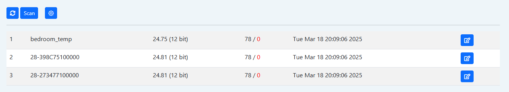
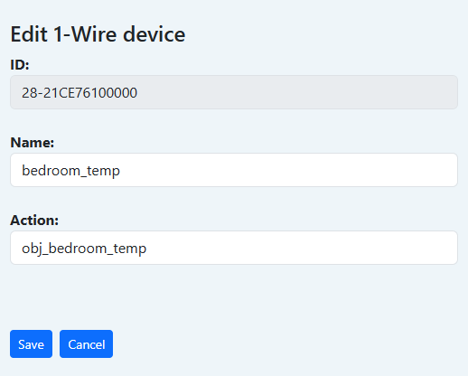
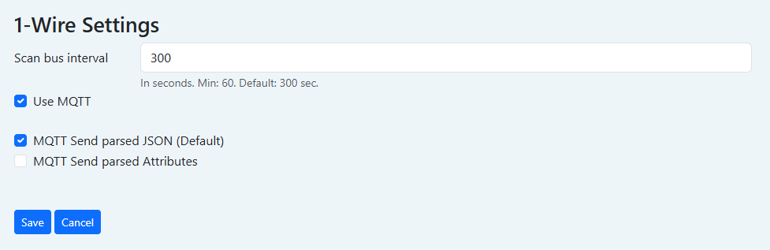

# 1-Wire

**Функционал поддерживается только для [Pro](/sls_pro.md) версии.**

Шлюз работает в режиме монитора шины и все обнаруженные устройства сохраняются во внутренней базе данных.

Количество подключаемых устройств 1-Wire на один порт не ограничено.

## Как работает

Работа шлюза 1-Wire реализована на выделенном мастере шины.
Подключение резисторов подтяжки не требуется, есть активная подтяжка шины.

Подключение возможно как в активном (3 проводное), так и пассивном режиме (2 проводное).
Для питания есть выход +5V.

Сканирование шины происходит при старте контроллера и далее каждые 5 минут (задается в настройках).
Чтение данных датчиков каждые 60 секунд.

## Поддерживаемые устройства

- DS18B20 (0x28) - калиброванный цифровой датчик температуры (12bit)
- DS1822 (0x22) - калиброванный цифровой датчик температуры (12bit)
- DS18S20 (0x10) - калиброванный цифровой датчик температуры (9bit)

Если Вам необходима поддержка других устройств, сообщите об этом.

## Web-интерфейс

Для включения необходимо включить его в сервисах.


В веб-интерфейсе видны все обнаруженные датчики и можно вручную просканировать шину.


Можно настроить имя датчика и привязку к объекту, в который будет передаваться каждое новое значение.


## MQTT

В настройках включается интеграция с MQTT и интервал автоматического поиска новых устройств на шине.


При получении новых данных с датчиков, они публикуются в топики:
1) Для режима передачи атрибутов, само значени в топик: _1wire/{$NAME$}/temperature_

   Где {$NAME$} это имя датчика или его идентификатор если не задано имя вида: 28-XXXXXXXXXXXX

2) Для режима передачи JSON, публикуется в топик _1wire/{$NAME$}_
 
   Сам JSON вида: {"temperature": {$VALUE$}}


Для режима передаи JSON датчика автоматически пробрасываются в Home Assistant.

## Работа из скриптов

Получить значение с датчика _28-XXXXXXXXXXXX_:

```lua
require "ow"
local t = ow.get("28-XXXXXXXXXXXX", "temperature")
print(t)
```
