# Supported devices:

| Фото  | Описание  | Модель |
|:------------- |:---------------:| -------------:|
|    | Tuya Repeater |[Open](1/readme.md) |
|    | Tuya Moes Smart light switch module (1 gang) (MS-104Z) |[Open](2/readme.md)
|    | Tuya Curtain motor/roller blind motor/window pusher/tubular motor |[Open](3/readme.md)
|    | Tuya Blitzwolf Water leak sensor (BW IS5) |[Open](4/readme.md)
|    | Tuya Smart Valve Upgrade |[Open](5/readme.md)
|    | Tuya 1 gang switch with N |[Open](6/readme.md)
|    | Tuya 2 gang switch with N |[Open](7/readme.md)
|    | Tuya 3 gang switch with N |[Open](8/readme.md)
| 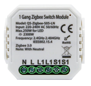   | Tuya 1 gang switch module with N (QS-Zigbee-S05-LN) |[Open](9/readme.md)
| 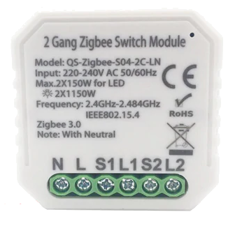  | Tuya 2 gang switch module with N (QS-Zigbee-S04-2C-LN) |[Open](10/readme.md)
| 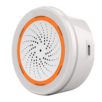  | Tuya Neo Temperature & humidity sensor and alarm (NAS-AB02B0) |[Open](11/readme.md)
| 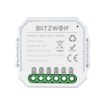  | Tuya Blitzwolf 1 gang switch module with N (BW-SS7) |[Open](12/readme.md)
| 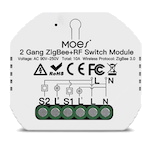  | Tuya Moes Smart light switch module (2 gang) (MS-104BZ) |[Open](13/readme.md)
| 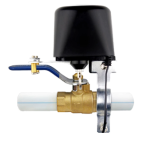  | Tuya Smart Valve |[Open](14/readme.md)
|   | Tuya Zigbee Smart Socket EU Plug 16A Adapter |[Open](15/readme.md)
| 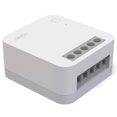  | Aqara single switch module T1 (with neutral) (SSM-U01) |[Open](16/readme.md)
| 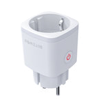  | Tuya Blitzwolf Smart Socket EU Plug 16A Adapter (BW SHP-13) |[Open](17/readme.md)
|   | Tuya DIN Rail Energy meter with Relay (DDS238-2) |[Open](18/readme.md)
|   | DIY Impulse counter |[Open](19/readme.md)
| 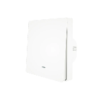{ height="150px" width="150px" }  | eWeLink ZB-SW01 - 1 gang wall switch with N |[Open](eWeLink/zb-sw01/readme.md)
| 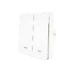{ height="150px" width="150px" }  | eWeLink ZB-SW02 - 2 gang switch with N |[Open](eWeLink/zb-sw01/readme.md)
| 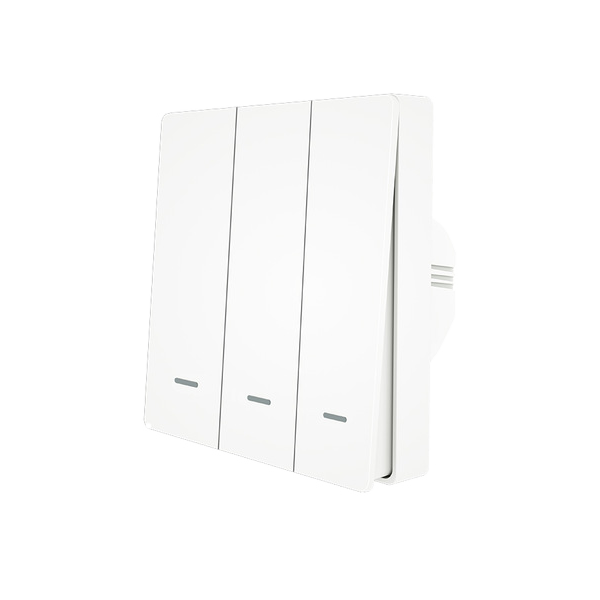{ height="150px" width="150px" }  | eWeLink ZB-SW03 - 3 gang switch with N |[Open](eWeLink/zb-sw01/readme.md)
