# Supported devices:

| Id | Photo  | Have in lab | Description  | Open |
|:-:|:------------- |:---------------:|:---------------:| -------------:|
|1|    |  | Tuya Repeater |[Open](1/readme.md) |
|2|    |  | Tuya Moes Smart light switch module (1 gang) (MS-104Z) |[Open](2/readme.md)
|3|    |  | Tuya Curtain motor/roller blind motor/window pusher/tubular motor |[Open](3/readme.md)
|4|    |  | Tuya Blitzwolf Water leak sensor (BW IS5) |[Open](4/readme.md)
|5|    |  | Tuya Smart Valve Upgrade |[Open](5/readme.md)
|6|    |  | Tuya 1 gang switch with N |[Open](6/readme.md)
|7|    |  | Tuya 2 gang switch with N |[Open](7/readme.md)
|8|    |  | Tuya 3 gang switch with N |[Open](8/readme.md)
|9|    |  | Tuya 1 gang switch module with N (QS-Zigbee-S05-LN) |[Open](9/readme.md)
|10|   |  | Tuya 2 gang switch module with N (QS-Zigbee-S04-2C-LN) |[Open](10/readme.md)
|11|   |  | Tuya Neo Temperature & humidity sensor and alarm (NAS-AB02B0) |[Open](11/readme.md)
|12|   |  | Tuya Blitzwolf 1 gang switch module with N (BW-SS7) |[Open](12/readme.md)
|13|   |  | Tuya Moes Smart light switch module (2 gang) (MS-104BZ) |[Open](13/readme.md)
|14|   |  | Tuya Smart Valve |[Open](14/readme.md)
|15|   | + | Tuya Zigbee Smart Socket EU Plug 16A Adapter |[Open](15/readme.md)
|16|   | + | Aqara single switch module T1 (with neutral) (SSM-U01) |[Open](16/readme.md)
|17|   | + | Tuya Blitzwolf Smart Socket EU Plug 16A Adapter (BW SHP-13) |[Open](17/readme.md)
|18|   | + | Tuya DIN Rail Energy meter with Relay (DDS238-2) |[Open](18/readme.md)
|19|   | + | DIY Impulse counter |[Open](19/readme.md)
|21| 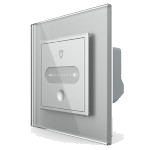  | + | Livolo Dimmer |[Open](21/readme.md)
|22| 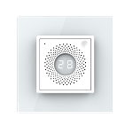  | + | Livolo Temperature & Humidity Sensor |[Open](22/readme.md)
|23| 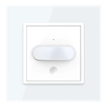  | + | Livolo Motion Sensor |[Open](23/readme.md)
|25|   |  | eWeLink Light RGBW (ZB-RGBCW) |[Open](25/readme.md)
|26| 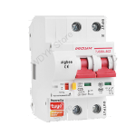  |  | Tuya 2P circuit breaker |[Open](26/readme.md)
|27| 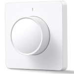  | + | Lonsonho Dimmer Switch |[Open](27/readme.md)
|28| 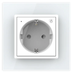  | + | Livolo Socket |[Open](28/readme.md)
|29| 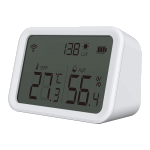  | + | Neo Temperature, Humidity And Light Intensity Sensor |[Open](29/readme.md)
|30| 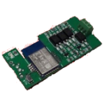  | + | DIY Doorphone controller (ZIntercom) |[Open](30/readme.md)
|31| 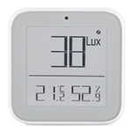  |  | Tuya Moes E-Ink Temperature, Humidity And Light Intensity Sensor |[Open](31/readme.md)
|32| 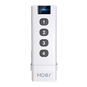  |  | DIY ptvo_switch_3ch |[Open](32/readme.md)
|33|   |  | Tuya Moes Scene remote |[Open](33/readme.md)
|34|   |  | Tuya 2 gang sensor switch w/o neutral |[Open](34/readme.md)
|35|   | + | Tuya Lonsonho Curtain switch (11830304) |[Open](35/readme.md)
|36|   |  | Tuya Lonsonho Curtain module (QS-Zigbee-C01) |[Open](36/readme.md)
|37| 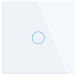  | + | Livolo Sensor Switch |[Open](37/readme.md)
|[38](38/readme.md)|   |  | Livolo 2 gang Sensor Switch
|[39](39/readme.md)| [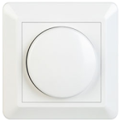](39/readme.md)  |  | Tuya Rotary dimmer w/o neutral
|[40](40/readme.md)|   |  | TRADFRI bulb E26/E27 CWS 800/806 lumen, dimmable, color, opal white (LED1924G9)
|[41](41/readme.md)| [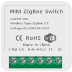](41/readme.md)  | + | Tuya relay module 10A
|[42](42/readme.md)| [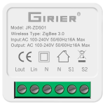](42/readme.md)  |  | Tuya relay module 16A
|[43](43/readme.md)| [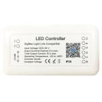](43/readme.md)  | + | Tuya Mini led strip controller 5V/12V/24V RGB+CCT
|[44](44/readme.md)|   | + | Tuya Moes BHT series Thermostat
|[45](45/readme.md)| [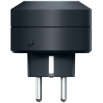](45/readme.md)  | + | LifeControl Power plug (MCLH-03)
|[46](46/readme.md)| [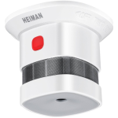](46/readme.md)  |  | Heiman Smoke detector (HS1SA-E)
|[47](47/readme.md)| [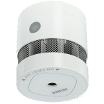](47/readme.md)  | + | Heiman Smoke detector (HS3SA-E)
|[48](48/readme.md)|   |  | DIY Flower Sensor (ZeeFlora)
|[49](49/readme.md)| [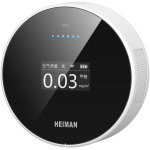](49/readme.md)  | + | Heiman Air quality monitor (HS2AQ-EM)
|[50](50/readme.md)|   | + | Tuya FrankEver Smart valve (FK_V02)
|[51](51/readme.md)|   |  | Xiaomi Aqara E1 2 gang switch (without neutral)
|[52](52/readme.md)|   |  | Xiaomi Aqara smart RGBW light controller (ZNTGMK11LM)
|[53](53/readme.md)| [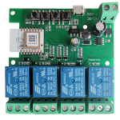](53/readme.md)  |  | Tuya 4Ch relay
|[54](54/readme.md)| [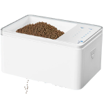](54/readme.md)  |  | Fish feeder
|[55](55/readme.md)| [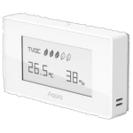](55/readme.md)  |  | Xiaomi Aqara TVOC air quality monitor (VOCKQJK11LM)
|[56](56/readme.md)|   |  | IKEA TRADFRI LED bulb E14 WW clear 250 lumen, dimmable (LED1935C3)
|[57](57/readme.md)|   |  | IKEA TRADFRI LED bulb E27 WW clear 250 lumen, dimmable (LED1934G3)
|[58](58/readme.md)| [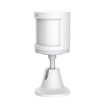](58/readme.md)  |  | Xiaomi Aqara T1 human body movement and illuminance sensor (RTCGQ12LM)
