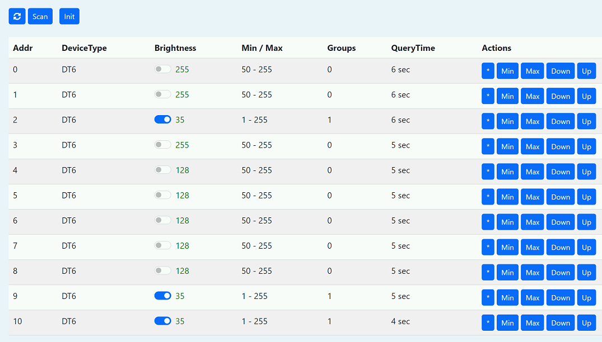

# Модуль управления освещением

**Функционал поддерживается только для [Pro](/sls_pro.md) версии.**
Модуль предназначен для установки в контролер [SLS DIN Mini](din_mini_base_rus.md).

Модуль добавляет следующую функциональность:

- DALI-мастер интерфейс

- DALI блок питания шины

- Выход 0-10В (2шт)

- Выход 0-20mA (2шт)

## Внешние клеммы

1. CH1 OUT 0-10V (IO32)
2. CH2 OUT 0-10V (IO35)
3. CH3 OUT 0-20mA (IO26)
4. CH4 OUT 0-20mA (IO27)
5. DALI +
6. DALI -

## Web-интерфейс
После инициализации интерфейса интерфейс доступен по адресу */dali*


Интерфейс позволяет сканировать и инициализировать DALI светильники, видеть их тип, минимальную, максимальную и текущую яркость, привязку к группам. Можно включать,выключать, идентифицировать светильники.

## DALI интерфейс

Для инициализации интерфейса достаточно добавить в скрипт _init.lua_ следующий вызов:

```lua
dali.begin()
```

Сканирование шины DALI для поиска устройств (с короткими адресами), результат поиска с типами устройств выводится в консоль и как возвращаемое значение:

```lua
dali.scan()
```

Отправка команды на включение всех устройств:

```lua
dali.on()
```

Отправка команды на выключение всех устройств:

```lua
dali.off()
```

Отправка команды мигания устройства 5:

```lua
dali.blink(true, 5)
```

Смена адреса устройства с 1 на 36:

```lua
dali.setaddr(1, 36)
```

Отправка команд реализована через функцию dali.cmd(cmd, params)

где:

- cmd (string) - содержит имя команды из таблицы ниже
- params (table) - параметры команды

Параметры:

- addrtype (string) - тип адреса, необходимо для адресуемых команда, возможные значения: short, group, broadcast
- address (number) - короткий адрес или группа
- value (number) - параметр

### Возвращаемый результат

Если команда не возвращает результат, то возвращает true, если должна возвращать, но произошла ошибка, возвращает nil и код ошибки.

Коды ошибок:

- -7 bus power down
- -6 bus busy
- -5 bad address
- -4 receive timeout
- -3 unknown command
- -2 unknown addrType
- -1 ok, no return
- 0-255 return

### Команды

|    №    | Команда            | Описание                                              | Адресуемая | С ответом | Диапазон |
| :-----: | ------------------ | ----------------------------------------------------- | :--------: | :-------: | :------: |
|    -    | arc                | Прямое управление яркостью                            |     \*     |           |  0..254  |
|    -    | blink              | Запускает мигание с периодичностью 1 секунда          |     \*     |           |          |
|    -    | on                 | Включает устройство                                   |     \*     |           |          |
|    0    | off                | Выключает устройство                                  |     \*     |           |          |
|    1    | up                 |                                                       |     \*     |           |          |
|    2    | down               |                                                       |     \*     |           |          |
|    3    | stepup             |                                                       |     \*     |           |          |
|    4    | stepdown           |                                                       |     \*     |           |          |
|    5    | recallmax          | Устанавливает максимальную яркость                    |     \*     |           |          |
|    6    | recallmin          | Устанавливает минимальную яркость                     |     \*     |           |          |
|    7    | stepdownoff        |                                                       |     \*     |           |          |
|    8    | stepupon           |                                                       |     \*     |           |          |
|  16-31  | gotoscene          | Запускает сцену                                       |     \*     |           |  0..15   |
|   32    | reset              | Сбрасывает сохраненные параметры, кроме адреса        |     \*     |           |          |
|   33    | storeactual        | Задает яркость из DTR                                 |     \*     |           |          |
|   37    | identify           | Задает идентификацию устройства                       |     \*     |           |          |
|   42    | storemax           | Задает максимальный лимит яркости из DTR              |     \*     |           |          |
|   43    | storemin           | Задает минимальный лимит яркости из DTR               |     \*     |           |          |
|   44    | storesystemfailure | Задает яркость при аварии шины DALI из DTR            |     \*     |           |          |
|   45    | storepoweron       | Задает яркость при подаче питания из DTR              |     \*     |           |          |
|   46    | storefadetime      | Задает fade time из DTR                               |     \*     |           |          |
|   47    | storefaderate      | Задает fade rate из DTR                               |     \*     |           |          |
|  64-79  | storescene         | Сохраняет значение DTR как сцену                      |     \*     |           |  0..15   |
|  80-95  | removescene        | Удаляет сцену                                         |     \*     |           |  0..15   |
| 96-111  | addtogroup         | Добавляет устройство в группу                         |     \*     |           |  0..15   |
| 112-127 | removefromgroup    | Удаляет устройство из группы                          |     \*     |           |  0..15   |
|   128   | storeshortaddress  |                                                       |     \*     |           |          |
|   144   | querystatus        |                                                       |     \*     |    \*     |          |
|   152   | querydtr           |                                                       |     \*     |    \*     |          |
|   153   | querydevicetype    | Возвращает тип устройства                             |     \*     |    \*     |          |
|   160   | queryactual        | Возвращает текущую яркость                            |     \*     |    \*     |          |
|   161   | querymax           | Возвращает максимальный лимит яркости                 |     \*     |    \*     |          |
|   162   | querymin           | Возвращает минимальный лимит яркости                  |     \*     |    \*     |          |
|   163   | querypoweron       | Возвращает яркость при подаче питания                 |     \*     |    \*     |          |
|   164   | querysystemfailure | Возвращает яркость при аварии шины DALI               |     \*     |    \*     |          |
|   165   | queryfadetimerate  | Возвращает fade time rate                             |     \*     |    \*     |          |
|   167   | querynextdevicetype| Возвращает nextdevicetype                             |     \*     |    \*     |          |
| 176-191 | queryscene         | Возвращает значение сцены                             |     \*     |    \*     |  0..15   |
|   192   | querygroupslow     | Возвращает битовую маску групп в которых состоит 0-7  |     \*     |    \*     |          |
|   193   | querygroupshigh    | Возвращает битовую маску групп в которых состоит 8-15 |     \*     |    \*     |          |
|    -    | setdtr             | Сохраняет значение в DTR                              |            |           |  0..255  |
|    -    | setdtr1            | Сохраняет значение в DTR1                             |            |           |  0..255  |
|    -    | setdtr2            | Сохраняет значение в DTR2                             |            |           |  0..255  |
|    -    | enabledevicetype   |                                                       |            |           |  0..253  |
|    -    | activate           |                                                       |     \*     |           |          |
|    -    | setrgbdimlevel     |                                                       |     \*     |           |          |
|    -    | setwafdimlevel     |                                                       |     \*     |           |          |


Отправка команды изменения яркости на 30 на устройство с коротким адресом 5:

```lua
dali.cmd('arc', { addrtype = 'short', address = 5, value = 30 })
```

Получает значение яркости для устройства с адресом 1:

```lua
print(dali.cmd('queryactual', { addrtype = 'short', address = 1 }))
```

Если на шине только одно устройство, назначает ему адрес 42:

```lua
address = 42
dali.cmd('setdtr', { addrtype = 'broadcast', value = address * 2 + 1 })
dali.cmd('storeshortaddress', { addrtype = 'broadcast' })
```

Добавляет устройство с адресом 1 в группу 5:

```lua
dali.cmd('addtogroup', { addrtype = 'short', address = 1, value = 5  })
```

Устанавливает минимальное значение яркости 100 для устройства с адресом 1:

```lua
dali.cmd('setdtr', { addrtype = 'broadcast', value = 100 })
dali.cmd('storemin', { addrtype = 'short', address = 1 })
```

## Управление через MQTT

Текущее состояние устройств приходит в виде JSON в топики вида *xxx/dali/{addrtype}*

Управление состоянием устройства:
Топик: *xxx/dali/{addrtype}/set/state* ON/OFF/TOGGLE

Управление яркостью устройства:
Топик: *xxx/dali/{addrtype}/set/brightness* 0..255

Отправка произвольных комманд:
Топик: *xxx/dali/{addrtype}/cmd/{cmd}*

Сообщение (опционально): value

где xxx - префикс шлюза

Результат отправки команды публикуется в топике *xxx/dali/result*

Отправка команды изменения яркости на 30 на устройство с коротким адресом 5:

```
Topic: xxx/dali/5/cmd/arc
Payload: 30
```

Отправка команды выключения на все устройства в группе 0:

```
Topic: xxx/dali/g0/cmd/off
Payload:
```

Отправка команды выключения на все устройства:

```
Topic: xxx/dali/broadcast/cmd/off
Payload:
```
