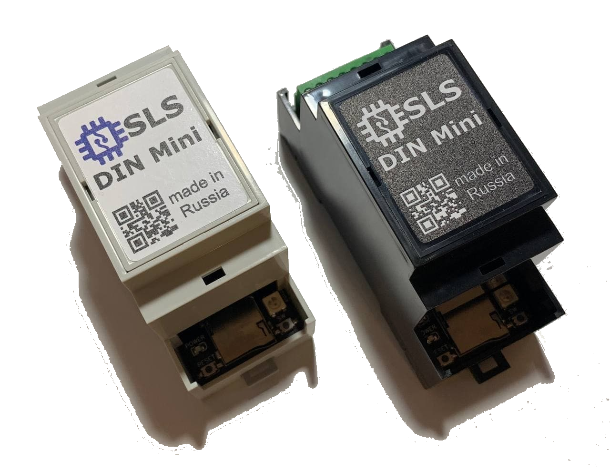

# Поддерживаемое "железо"
- [SLS DIN MINI](/devices/din_mini_base_rus.md) и модули расширения

- Zigbee шлюз [modkam.ru](https://modkam.ru/2021/09/21/plata-s-cc2652p-dlja-xiaomi-shljuza/) и альтернативные варианты

